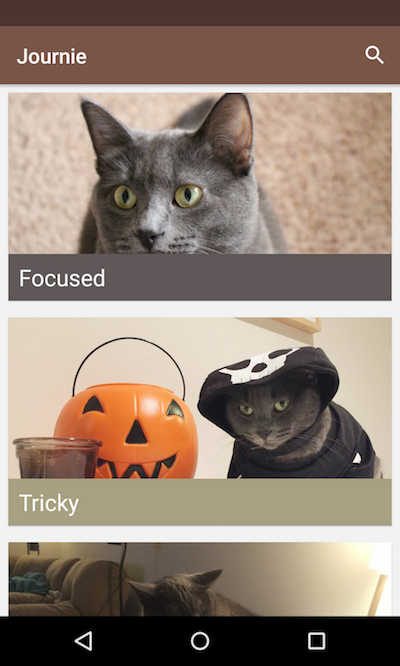
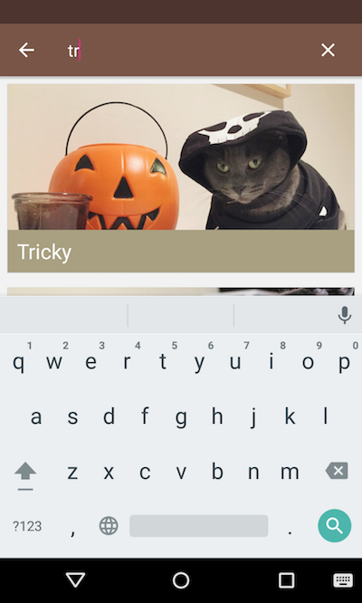
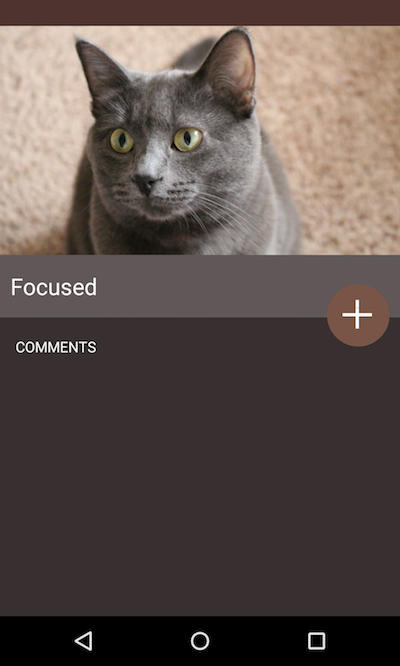
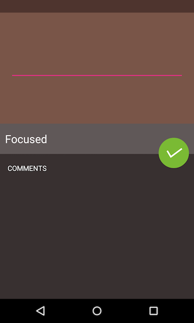

# material-journie 

A demo Material Design Android application using my cat Journie. Inspired by this [blog post](https://www.raywenderlich.com/103367/material-design).

## Pre-requisites

- Java 1.8
- Android SDK v23
- Gradle 2.8

## Getting Started

This project uses the Gradle build system. To build this project, use the "gradlew build" command or use "Import Project" in Android Studio. 

## Screens

 
 

License
---------------
This project is released under the MIT license. See LICENSE for details.